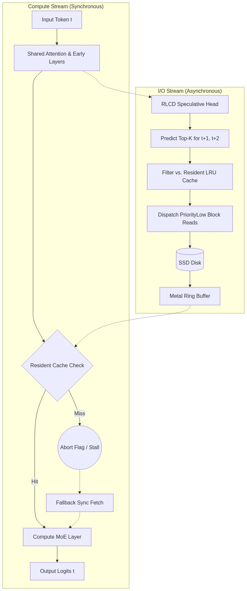

# Asynchronous Speculative Routing for Disk-Offloaded Mixture of Experts (MoE)

**Abstract:** 
Standard execution of massive Mixture of Experts (MoE) models via SSD offloading introduces severe I/O bottlenecks, often reducing inference speeds to $<2$ tokens/sec. This document outlines a novel pipeline leveraging an RLCD-calibrated speculative routing head and Apple Metal 3 asynchronous block reads to completely decouple expert routing from generation. By predicting routing paths $t+k$ tokens ahead, the architecture streams experts via DMA into a unified memory Ring Buffer, hiding I/O latency behind compute and maintaining mathematically identical accuracy with $0\%$ degradation.

---

## 1. Project Background and The I/O Bottleneck
In a standard MoE block, the router function $R(x)$ assigns token representations to a top- $k$ subset of $E$ total experts. 

$$ \text{Output} = \sum_{i \in \text{TopK}(R(x))} R(x)_i \cdot \text{Expert}_i(x) $$

When model weights exceed VRAM/Unified Memory, they must be paged from an SSD. Traditional frameworks (e.g., `llama.cpp` using `mmap`) execute synchronously. When $R(x)$ selects an expert not in RAM, the GPU suffers a page fault. Compute entirely stalls while the SSD fetches the weights. 

For a single token passing through $L$ layers, let $T_{compute}$ be the pure compute time, and $T_{fetch}$ be the I/O latency for missing experts. The generation time per token becomes:

$$ T_{total} = T_{compute} + \sum_{l=1}^{L} P(\text{miss}_l) \cdot T_{fetch} $$

Given that NVMe latency and throughput ($<10$ GB/s) are orders of magnitude slower than Unified Memory bandwidth (e.g., $400$ GB/s), $T_{fetch}$ dominates, crushing token generation rates.

---

## 2. Architecture: Asynchronous Lookahead Routing

To eliminate the $T_{fetch}$ term from the critical path, we introduce **Asynchronous Lookahead Routing**. 

Rather than waiting for layer $l$ to determine its routing, an auxiliary speculative head attached to early layers predicts the routing decisions for future horizons ($t+1, t+2$). 

---

## 3. Mathematical Formulation of the RLCD Router

The speculative head must be highly calibrated. It is not enough to have high accuracy; the model must "know what it doesn't know" to prevent aggressively fetching incorrect experts (wasting I/O bandwidth).

### 3.1 Training with MMCE
We fine-tune the routing head using Reinforcement Learning from Classifier Data (RLCD). The loss function combines standard Cross-Entropy with a Maximum Mean Calibration Error (MMCE) penalty in a Reproducing Kernel Hilbert Space (RKHS).

$$ \mathcal{L} = \mathcal{L}_{CE} + \lambda \cdot \text{MMCE}^2(f) $$

### 3.2 Temperature Scaling via LBFGS
Post-training, we optimize the logits $\hat{z}$ using Negative Log-Likelihood (NLL) over a temperature scalar $T$, optimized via LBFGS:

$$ \hat{p}_i = \frac{\exp(\hat{z}_i / T)}{\sum_j \exp(\hat{z}_j / T)} $$

We evaluate this calibration using the **Brier Score**, measuring the mean squared difference between predicted probabilities $\hat{p}_{ic}$ and the ground truth one-hot labels $y_{ic}$:

$$ BS = \frac{1}{N} \sum_{i=1}^N \sum_{c=1}^C (\hat{p}_{ic} - y_{ic})^2 $$

By minimizing the Brier score, the speculative head produces epistemically sound confidence thresholds.

---

## 4. Caching & Bandwidth Dynamics

The system manages a strictly isolated 16-slot Metal Ring Buffer and a 500MB Fallback Pool. The probability of an I/O stall (Cache Miss) is dictated by the temporal locality of the routing and the prediction accuracy of the RLCD head.

### 4.1 Extrapolating to Massive Models (e.g., 1 Trillion Parameters)

Can this run a 1T parameter MoE on an SSD at 4-6 tok/sec? **Yes, but bound by active bandwidth.**

A 1T parameter MoE is highly sparse. Suppose it has **20B active parameters per token**. 
At FP16 precision (2 bytes/param), the model requires exactly **40 GB of weights per token**. 

If we target **5 tokens/sec**, the system requires $40 \text{ GB} \times 5 = \textbf{200 GB/s}$ of effective weight bandwidth. 
No SSD in the world can sustain 200 GB/s (PCIe Gen 5 peaks at ~14 GB/s). 

**How does the math work then?**
The solution is the **LRU Cache (Resident Memory)**. In large MoEs, experts exhibit massive temporal locality (the same experts are used repeatedly for the same context). Let $P(\text{hit})$ be the probability that an active expert is already in the Resident Unified Memory cache (e.g., a 40GB RAM allocation).

The required SSD bandwidth $B_{ssd}$ becomes:
$$ B_{ssd} = \frac{N_{active} \cdot \text{Bytes} \cdot (1 - P(\text{hit}))}{T_{target\_latency}} $$

If the model relies on a few heavily used "shared" experts, $P(\text{hit})$ often exceeds $95\%$. 
With $P(\text{hit}) = 0.95$:
$$ B_{ssd} = 200 \text{ GB/s} \times 0.05 = \textbf{10 GB/s} $$

This is well within the bandwidth of a high-end NVMe RAID or PCIe Gen 5 SSD. The RLCD head's job is to read the remaining $5\%$ from the SSD *before* the GPU needs them, entirely hiding the 10 GB/s I/O latency.

---

## 5. Accuracy Preservation

Unlike speculative decoding for *tokens* (where incorrect guesses require graph rollbacks and KV-cache rewinds, occasionally causing degradation in approximations), this architecture predicts *routing paths*. 

If the RLCD router guesses wrong, the GPU arrives at Layer $l$, checks the Ring Buffer, and finds a miss. 
1. An `abort_flag` is flipped in the Metal Indirect Command Buffer (ICB).
2. The layer compute executes a cascading no-op: `if (*abort_flag != 0) return;`
3. A synchronous demand-fetch is issued to the SSD.
4. Once loaded, the correct expert executes. 

Because the logits are mathematically generated by the exact same experts as the native model, the accuracy degradation is exactly **$0\%$**. The only penalty for a wrong guess is a temporary drop in tok/sec.
